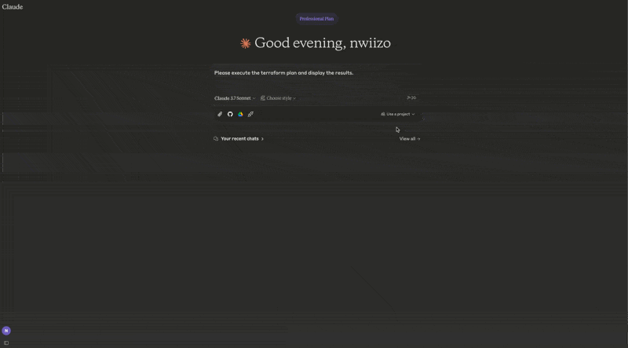

# tfmcp: Terraform Model Context Protocol Tool

*⚠️  This project includes production-ready security features but is still under active development. While the security system provides robust protection, please review all operations carefully in production environments. ⚠️*

tfmcp is a command-line tool that helps you interact with Terraform via the Model Context Protocol (MCP). It allows LLMs to manage and operate your Terraform environments, including:

## 🎮 Demo

See tfmcp in action with Claude Desktop:



- Reading Terraform configuration files
- Analyzing Terraform plan outputs
- Applying Terraform configurations
- Managing Terraform state
- Creating and modifying Terraform configurations

## 🎉 Latest Release

The latest version of tfmcp (v0.1.6) is now available on Crates.io! You can easily install it using Cargo:

```bash
cargo install tfmcp
```

### 🆕 What's New in v0.1.6
- **🔬 Module Health Analysis**: Whitebox IaC approach with cohesion/coupling metrics
- **📊 Resource Dependency Graph**: Visualize resource relationships and dependencies
- **🛠️ Refactoring Suggestions**: Actionable recommendations with migration steps
- **📦 Module Registry Support**: Search and explore Terraform modules
- **📚 MCP Resources**: Built-in style guides and best practices documentation

## Features

- 🚀 **Terraform Integration**
  Deeply integrates with the Terraform CLI to analyze and execute operations.

- 📄 **MCP Server Capabilities**
  Runs as a Model Context Protocol server, allowing AI assistants to access and manage Terraform.

- 🔬 **Module Health Analysis**
  Whitebox approach to Infrastructure as Code with cohesion/coupling analysis, health scoring, and refactoring suggestions based on software engineering principles.

- 📊 **Resource Dependency Graph**
  Visualize resource relationships including explicit depends_on and implicit reference dependencies.

- 📦 **Module Registry Integration**
  Search and explore Terraform modules from the registry, get module details and versions.

- 🔐 **Enterprise Security**
  Production-ready security controls with configurable policies, audit logging, and access restrictions.

- 📊 **Advanced Analysis**
  Detailed Terraform configuration analysis with best practice recommendations and security checks.

- ⚡️ **Blazing Fast**
  High-speed processing powered by the Rust ecosystem with optimized parsing and caching.

- 🛠️ **Automatic Setup**
  Automatically creates sample Terraform projects when needed, ensuring smooth operation even for new users.

- 🐳 **Docker Support**
  Run tfmcp in a containerized environment with all dependencies pre-installed.

## Installation

### From Source
```bash
# Clone the repository
git clone https://github.com/nwiizo/tfmcp
cd tfmcp

# Build and install
cargo install --path .
```

### From Crates.io
```bash
cargo install tfmcp
```

### Using Docker
```bash
# Clone the repository
git clone https://github.com/nwiizo/tfmcp
cd tfmcp

# Build the Docker image
docker build -t tfmcp .

# Run the container
docker run -it tfmcp
```

## Requirements

- Rust (edition 2021)
- Terraform CLI installed and available in PATH
- Claude Desktop (for AI assistant integration)
- Docker (optional, for containerized deployment)

## Usage

```bash
$ tfmcp --help
✨ A CLI tool to manage Terraform configurations and operate Terraform through the Model Context Protocol (MCP).

Usage: tfmcp [OPTIONS] [COMMAND]

Commands:
  mcp       Launch tfmcp as an MCP server
  analyze   Analyze Terraform configurations
  help      Print this message or the help of the given subcommand(s)

Options:
  -c, --config <PATH>    Path to the configuration file
  -d, --dir <PATH>       Terraform project directory
  -V, --version          Print version
  -h, --help             Print help
```

### Using Docker

When using Docker, you can run tfmcp commands like this:

```bash
# Run as MCP server (default)
docker run -it tfmcp

# Run with specific command and options
docker run -it tfmcp analyze --dir /app/example

# Mount your Terraform project directory
docker run -it -v /path/to/your/terraform:/app/terraform tfmcp --dir /app/terraform

# Set environment variables
docker run -it -e TFMCP_LOG_LEVEL=debug tfmcp
```

### Integrating with Claude Desktop

To use tfmcp with Claude Desktop:

1. If you haven't already, install tfmcp:
   ```bash
   cargo install tfmcp
   ```

   Alternatively, you can use Docker:
   ```bash
   docker build -t tfmcp .
   ```

2. Find the path to your installed tfmcp executable:
   ```bash
   which tfmcp
   ```

3. Add the following configuration to `~/Library/Application\ Support/Claude/claude_desktop_config.json`:

```json
{
  "mcpServers": {
    "tfmcp": {
      "command": "/path/to/your/tfmcp",  // Replace with the actual path from step 2
      "args": ["mcp"],
      "env": {
        "HOME": "/Users/yourusername",  // Replace with your username
        "PATH": "/usr/local/bin:/usr/bin:/bin:/usr/sbin:/sbin",
        "TERRAFORM_DIR": "/path/to/your/terraform/project"  // Optional: specify your Terraform project
      }
    }
  }
}
```

If you're using Docker with Claude Desktop, you can set up the configuration like this:

```json
{
  "mcpServers": {
    "tfmcp": {
      "command": "docker",
      "args": ["run", "--rm", "-v", "/path/to/your/terraform:/app/terraform", "tfmcp", "mcp"],
      "env": {
        "TERRAFORM_DIR": "/app/terraform"
      }
    }
  }
}
```

4. Restart Claude Desktop and enable the tfmcp tool.

5. tfmcp will automatically create a sample Terraform project in `~/terraform` if one doesn't exist, ensuring Claude can start working with Terraform right away. The sample project is based on the examples included in the `example/demo` directory of this repository.

## MCP Tools

tfmcp provides the following MCP tools for AI assistants:

### Core Terraform Operations
| Tool | Description |
|------|-------------|
| `terraform_init` | Initialize Terraform working directory |
| `terraform_plan` | Generate and show execution plan |
| `terraform_apply` | Apply Terraform configuration |
| `terraform_destroy` | Destroy Terraform-managed infrastructure |
| `terraform_validate` | Validate configuration syntax |
| `terraform_state` | Show current state |
| `list_resources` | List all managed resources |
| `set_terraform_directory` | Change active project directory |

### Module Health Analysis (v0.1.6)
| Tool | Description |
|------|-------------|
| `analyze_module_health` | Analyze module health with cohesion/coupling metrics, health score (0-100), issues detection, and recommendations |
| `get_resource_dependency_graph` | Build resource dependency graph showing nodes, edges (explicit/implicit), and module boundaries |
| `suggest_module_refactoring` | Generate refactoring suggestions (SplitModule, WrapPublicModule, AddDescriptions, FlattenHierarchy) with migration steps |

### Module Registry
| Tool | Description |
|------|-------------|
| `search_terraform_modules` | Search Terraform modules in the registry |
| `get_module_details` | Get detailed information about a module |
| `get_latest_module_version` | Get the latest version of a module |
| `get_latest_provider_version` | Get the latest version of a provider |

### Provider Information
| Tool | Description |
|------|-------------|
| `search_providers` | Search Terraform providers |
| `get_provider_details` | Get detailed provider information |
| `list_provider_versions` | List available provider versions |

## Logs and Troubleshooting

The tfmcp server logs are available at:
```
~/Library/Logs/Claude/mcp-server-tfmcp.log
```

Common issues and solutions:

- **Claude can't connect to the server**: Make sure the path to the tfmcp executable is correct in your configuration
- **Terraform project issues**: tfmcp automatically creates a sample Terraform project if none is found
- **Method not found errors**: MCP protocol support includes resources/list and prompts/list methods
- **Docker issues**: If using Docker, ensure your container has proper volume mounts and permissions

## Environment Variables

### Core Configuration
- `TERRAFORM_DIR`: Set this to specify a custom Terraform project directory. If not set, tfmcp will use the directory provided by command line arguments, configuration files, or fall back to `~/terraform`. You can also change the project directory at runtime using the `set_terraform_directory` tool.
- `TFMCP_LOG_LEVEL`: Set to `debug`, `info`, `warn`, or `error` to control logging verbosity.
- `TFMCP_DEMO_MODE`: Set to `true` to enable demo mode with additional safety features.

### Security Configuration
- `TFMCP_ALLOW_DANGEROUS_OPS`: Set to `true` to enable apply/destroy operations (default: `false`)
- `TFMCP_ALLOW_AUTO_APPROVE`: Set to `true` to enable auto-approve for dangerous operations (default: `false`)
- `TFMCP_MAX_RESOURCES`: Set maximum number of resources that can be managed (default: 50)
- `TFMCP_AUDIT_ENABLED`: Set to `false` to disable audit logging (default: `true`)
- `TFMCP_AUDIT_LOG_FILE`: Custom path for audit log file (default: `~/.tfmcp/audit.log`)
- `TFMCP_AUDIT_LOG_SENSITIVE`: Set to `true` to include sensitive information in audit logs (default: `false`)

## Security Considerations

tfmcp includes comprehensive security features designed for production use:

### 🔒 Built-in Security Features
- **Access Controls**: Automatic blocking of production/sensitive file patterns
- **Operation Restrictions**: Dangerous operations (apply/destroy) disabled by default
- **Resource Limits**: Configurable maximum resource count protection
- **Audit Logging**: Complete operation tracking with timestamps and user identification
- **Directory Validation**: Security policy enforcement for project directories

### 🛡️ Security Best Practices
- **Default Safety**: Apply/destroy operations are disabled by default - explicitly enable only when needed
- **Review Plans**: Always review Terraform plans before applying, especially AI-generated ones
- **IAM Boundaries**: Use appropriate IAM permissions and role boundaries in cloud environments
- **Audit Monitoring**: Regularly review audit logs at `~/.tfmcp/audit.log`
- **File Patterns**: Built-in protection against accessing `prod*`, `production*`, and `secret*` patterns
- **Docker Security**: When using containers, carefully consider volume mounts and exposed data

### ⚙️ Production Configuration
```bash
# Recommended production settings
export TFMCP_ALLOW_DANGEROUS_OPS=false    # Keep disabled for safety
export TFMCP_ALLOW_AUTO_APPROVE=false     # Require manual approval
export TFMCP_MAX_RESOURCES=10             # Limit resource scope
export TFMCP_AUDIT_ENABLED=true           # Enable audit logging
export TFMCP_AUDIT_LOG_SENSITIVE=false    # Don't log sensitive data
```

## Contributing

Contributions are welcome! Please feel free to submit a Pull Request.

1. Fork the repository
2. Create your feature branch (`git checkout -b feature/amazing-feature`)
3. Run quality checks before committing:
   ```bash
   cargo fmt --all
   cargo clippy --all-targets --all-features
   cargo test --all-features
   ```
4. Commit your changes (`git commit -m 'Add some amazing feature'`)
5. Push to the branch (`git push origin feature/amazing-feature`)
6. Open a Pull Request

### Release Process

Releases are done manually (automated CI release is disabled):

1. Update version in `Cargo.toml`
2. Create GitHub release: `gh release create v0.1.x --title "v0.1.x - Title" --notes "Release notes"`
3. Publish to crates.io: `cargo publish`

## Roadmap

Here are some planned improvements and future features for tfmcp:

### Completed
- [x] **Basic Terraform Integration**  
  Core integration with Terraform CLI for analyzing and executing operations.

- [x] **MCP Server Implementation**  
  Initial implementation of the Model Context Protocol server for AI assistants.

- [x] **Automatic Project Creation**  
  Added functionality to automatically create sample Terraform projects when needed.

- [x] **Claude Desktop Integration**  
  Support for seamless integration with Claude Desktop.

- [x] **Core MCP Methods**  
  Implementation of essential MCP methods including resources/list and prompts/list.

- [x] **Error Handling Improvements**  
  Better error handling and recovery mechanisms for robust operation.

- [x] **Dynamic Project Directory Switching**  
  Added ability to change the active Terraform project directory without restarting the service.

- [x] **Crates.io Publication**  
  Published the package to Crates.io for easy installation via Cargo.
  
- [x] **Docker Support**  
  Added containerization support for easier deployment and cross-platform compatibility.

- [x] **Security Enhancements**
  Comprehensive security system with configurable policies, audit logging, access controls, and production-ready safety features.

- [x] **Module Health Analysis (v0.1.6)**
  Whitebox approach to IaC with cohesion/coupling metrics, health scoring, and refactoring suggestions.

- [x] **Resource Dependency Graph (v0.1.6)**
  Visualization of resource relationships including explicit and implicit dependencies.

- [x] **Module Registry Integration (v0.1.6)**
  Search and explore Terraform modules from the registry.

- [x] **Comprehensive Testing Framework**
  74+ tests including integration tests with real Terraform configurations.

### In Progress
- [ ] **Multi-Environment Support**
  Add support for managing multiple Terraform environments, workspaces, and modules.

### Planned
- [ ] **Expanded MCP Protocol Support**
  Implement additional MCP methods and capabilities for richer integration with AI assistants.

- [ ] **Performance Optimization**  
  Optimize resource usage and response times for large Terraform projects.

- [ ] **Cost Estimation**  
  Integrate with cloud provider pricing APIs to provide cost estimates for Terraform plans.

- [ ] **Interactive TUI**  
  Develop a terminal-based user interface for easier local usage and debugging.

- [ ] **Integration with Other AI Platforms**  
  Extend beyond Claude to support other AI assistants and platforms.

- [ ] **Plugin System**  
  Develop a plugin architecture to allow extensions of core functionality.

## License

This project is licensed under the MIT License - see the [LICENSE](LICENSE) file for details.
